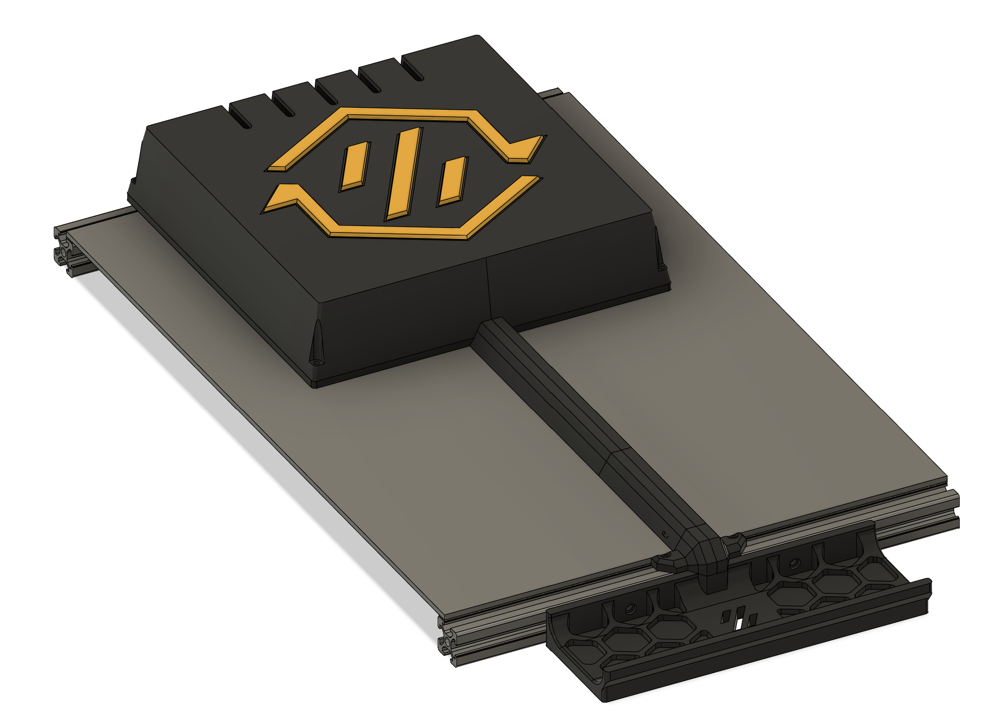
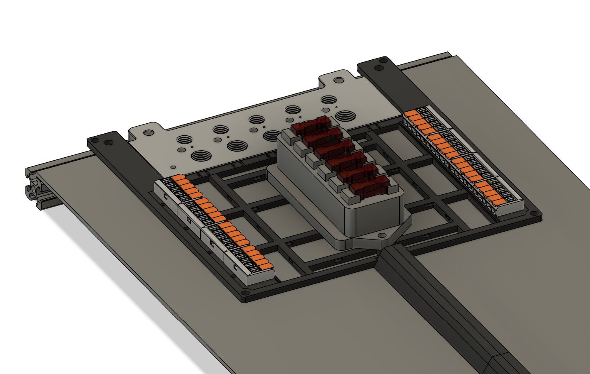
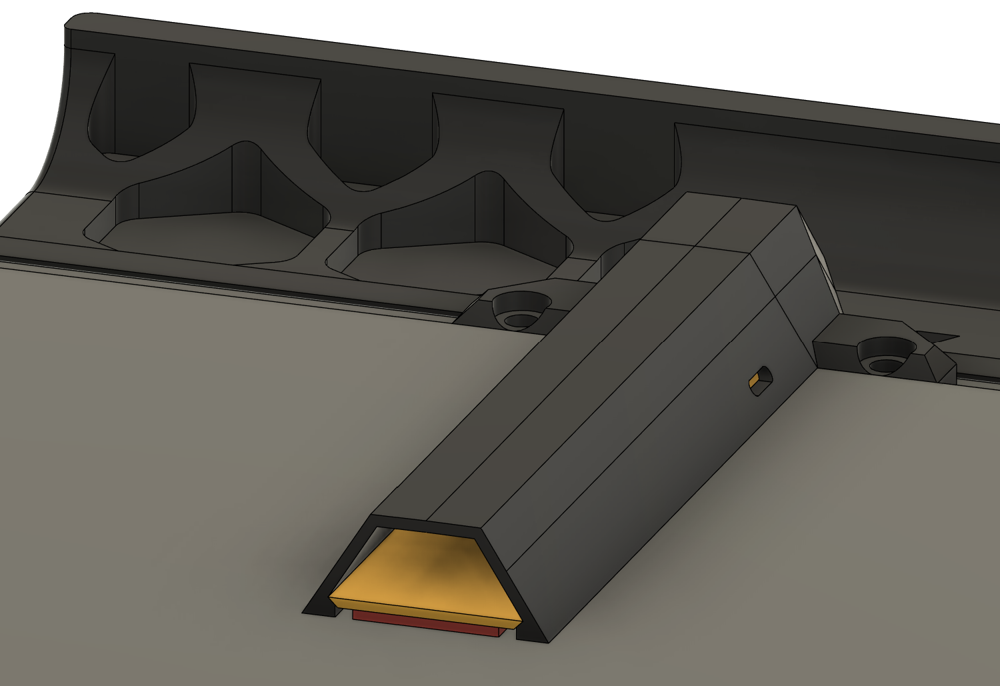
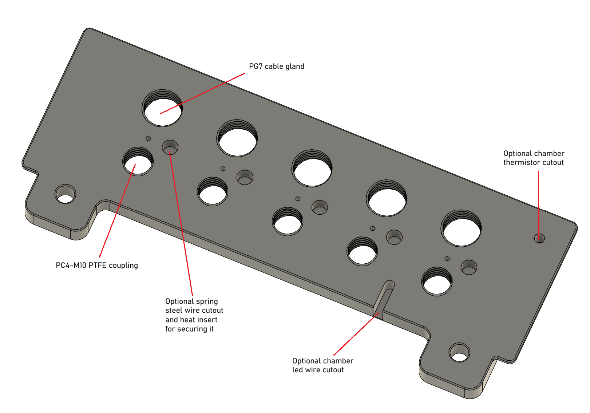

# Modular backpack & exhaust plate for Voron toolchangers

Made for my StealthChanger build, should work for Tapchanger and other toolchanger mods too. Pick a configuration that suits your current and future needs!

* Exhaust plate variations for 2-6 umbilical toolheads
    * pg7 cable gland
    * ptfe coupling
    * optional spring steel wire
    * optional cutouts for cables routing into chamber and chamber thermistor
* Backpack for toolhead wiring, power and CAN for 2-6 toolheads
    * Optional cheap fuse box with car fuses for individual toolheads
* Cable duct down to the main electronics compartment

Support for more hardware to come:
* BTT CEB
* LDO Nitehawk breakout boards
* Power distribution board(s)

With lid on:

Without lid:

The duct (black top, yellow = printed base, red = VHB double-sided tape):

Exhaust plate for 5 tools:

## BOM

### Printed parts

* **Important:** Printed parts not yet rotated for printing! Use your best judgement and reorient where needed. 
* Voron parts naming standard and print settings. It should be safe to do 0.6 line width and 3 perimiters for a bit faster print times.
* Alternatives prefixed with a double dash `--` meaning that you pick one of the variations for each prefix.
* You need to print a base + a lid with an optional logo + duct parts for your printer size.

### Exhaust plate for X tools
* 2 M5x12
* 2 M5 T-nuts
* X PG7 cable glands
* X PC4-M10 pneumatic coupling for ptfe tubes
* Optional: X 0.8-1.0 mm spring steel wires
* Optional: X M3 heat inserts (Voron standard M3xD5xL4)
* Optional: X M3x4 or M3x6

### Duct:
* 2 M3x8
* 2 M3 T-nuts
* 1mm thick VHB tape for the duct

### Backpack
* 2 M5x12
* 2 M5 T-nuts
* 4 heat inserts, one in each corner for the lid
* 4 M3x10 or M3x12 for the lid
* 4 Wago 221-415 terminal blocks for 1-4 toolheads
* Additional 4x Wago 221-415 terminal blocks for 5-6 toolheads
* Number of wagos x M3x10 or M3x8
* Optional: [Amazon car fuse box](https://www.amazon.com/HiSport-Waterproof-Negative-Suitable-Trailer/dp/B0B18F21FL/) for individual toolhead fuses + 2x M5x10 to mount it
* Optional: Fuses for each toolhead (typically 3A=72W or 5A=120W)